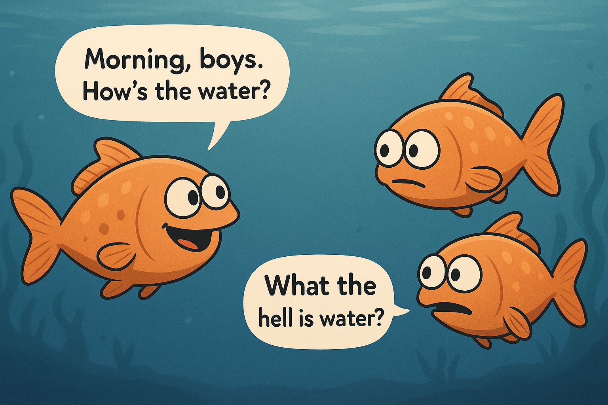

import Callout from "@/components/Callout.astro";
import HumanVsAIRadarChart from "@/components/HumanVsAIRadarChart.astro";
import TaskEquationVisualizer from "@/components/TaskEquationVisualizer.astro";

## TL;DR

Por que algumas pessoas conseguem excelentes resultados com IA enquanto outras não? A resposta está em três fatores: conhecimento, contexto e ferramentas. Eles se multiplicam para determinar a probabilidade de sucesso de uma tarefa.

- Humanos: Limitados em conhecimento, mas ricos em contexto (através de entendimento compartilhado) e com acesso praticamente ilimitado a ferramentas.
- IAs: Vastas em conhecimento, mas dependem de contexto explícito e têm acesso limitado a ferramentas.

A diferença entre obter código de qualidade e alucinações sem sentido não é sorte ou habilidade técnica, mas entender que na era da IA, o contexto é o gargalo.

---

## Motivação

Algumas pessoas afirmam que a IA vai acabar com os empregos e que nós humanos estamos condenados a viver de renda básica universal. Outras descartam como hype e que não passa de mais uma bolha.

Eu acredito que essa tecnologia é real, veio para ficar porém para obtermos o máximo dela precisamos entender o que realmente determina o sucesso com esses sistemas.

Por um tempo, venho refletindo sobre uma pergunta simples:
> Por que algumas pessoas conseguem resultados consistentemente bons com IA enquanto outras não?

Alguns desenvolvedores multiplicam sua produtividade e criam projetos usado por milhares de usuários, enquanto outros geram alucinações sem sentido que nem compilam. [Alguns times automatizam horas de trabalho repetitivo](https://ghuntley.com/ralph/), enquanto outros lutam para obter até mesmo respostas básicas. O que explica essa diferença?

Não se trata de ser "bom com computadores" ou ter acesso aos modelos mais recentes. Algo mais fundamental está em jogo. Eu acredito que isso exige um conjunto de habilidades completamente diferente.

Após incontáveis horas experimentando com modelos, construindo agentes de IA, programando com editores de IA, usando as CLIs mais recentes, e ajudando outros a obterem o máximo das ferramentas de IA, cheguei a uma equação simples que captura meu modelo mental para a probabilidade de sucesso.

Este artigo é minha tentativa de compartilhar esse framework.

---

## A equação

Imagine que alguém te dá uma tarefa. O que determina se você terá sucesso? Podemos dividir isso em três fatores principais:

1. **<span class="term-knowledge">Conhecimento (K)</span>**: o que você já sabe. Isso inclui sua expertise, hard skills aprendidas, experiências passadas e sabedoria acumulada.  
2. **<span class="term-context">Contexto (C)</span>**: informações sobre esta tarefa específica. Quem, o quê, quando, onde e por quê que transforma uma solicitação genérica em uma tarefa realizável.  
3. **<span class="term-tools">Ferramentas (T)</span>**: o que você pode usar para executar a tarefa. Instrumentos, software, processos, colaboradores, ou sua habilidade de inventar novas soluções.

Depois de pensar sobre como esses fatores interagem entre si, eu diria que a probabilidade de sucesso é o produto desses fatores:

> <p class="text-xl font-semibold rounded-lg p-2">p = <span class="term-knowledge">K</span> × <span class="term-context">C</span> × <span class="term-tools">T</span></p>

Diferentes tipos de tarefas requerem diferentes equilíbrios desses fatores. É improvável que um encanador <span class="term-knowledge">experiente</span> consiga resolver um vazamento sem as <span class="term-tools">ferramentas certas</span>, já um advogado dificilmente conseguiria resolver um caso sem <span class="term-knowledge">conhecimento jurídico</span> e se debruçar no <span class="term-context">contexto do caso</span>. Isso leva à equação completa:

> <p class="text-xl font-semibold rounded-lg p-2">p = <span class="term-knowledge">K</span><sup><span class="term-knowledge-weight">α</span></sup> × <span class="term-context">C</span><sup><span class="term-context-weight">β</span></sup> × <span class="term-tools">T</span><sup><span class="term-tools-weight">γ</span></sup></p>

Os expoentes são utilizados para ajustar a importância de cada fator para cada tipo de tarefa, com <span class="term-knowledge-weight">α</span>, <span class="term-context-weight">β</span>, <span class="term-tools-weight">γ</span> ≥ 0 e <span class="term-knowledge-weight">α</span> + <span class="term-context-weight">β</span> + <span class="term-tools-weight">γ</span> = 1. Confira o visualizador interativo abaixo para ver como a equação funciona.

<details class="animate group rounded-lg border border-black/15 dark:border-white/20 mb-6">
    <summary class="cursor-pointer rounded-t-lg px-3 py-1.5 font-medium transition-colors group-open:bg-black/5 hover:bg-black/5 dark:group-open:bg-white/5 hover:dark:bg-white/5">Entendendo os expoentes</summary>
    <div class="py-3 px-6">
    Os expoentes determinam o quanto cada fator influencia a probabilidade geral. Quando um expoente se aproxima de 0, esse componente se torna menos crítico para o sucesso. Quando é maior, esse componente tem mais impacto no resultado final.

    Por exemplo, se <span class="term-context-weight">β</span> = <span class="term-context-weight">0.8</span> e <span class="term-knowledge-weight">α</span> = <span class="term-knowledge-weight">0.1</span>, então o <span class="term-context">contexto</span> domina: mesmo com <span class="term-knowledge">conhecimento</span> perfeito (<span class="term-knowledge">K</span>=<span class="term-knowledge">1.0</span>), <span class="term-context">contexto</span> ruim (<span class="term-context">C</span>=<span class="term-context">0.2</span>) daria:

    <Callout>
        p = <span class="term-knowledge">1.0</span>^<span class="term-knowledge-weight">0.1</span> × <span class="term-context">0.2</span>^<span class="term-context-weight">0.8</span> × <span class="term-tools">T</span>^<span class="term-tools-weight">0.1</span> ≈ <span class="term-context">0.28</span> × <span class="term-tools">T</span>^<span class="term-tools-weight">0.1</span>
    </Callout>

    Mas com bom <span class="term-context">contexto</span> (<span class="term-context">C</span>=<span class="term-context">0.9</span>), você obtém:

    <Callout>
        p = <span class="term-knowledge">1.0</span>^<span class="term-knowledge-weight">0.1</span> × <span class="term-context">0.9</span>^<span class="term-context-weight">0.8</span> × <span class="term-tools">T</span>^<span class="term-tools-weight">0.1</span> ≈ <span class="term-context">0.92</span> × <span class="term-tools">T</span>^<span class="term-tools-weight">0.1</span>
    </Callout>

    Cada expoente importa de forma diferente dependendo da situação:

    - **<span class="term-knowledge-weight">α</span> (expoente do <span class="term-knowledge">conhecimento</span>):** Maior para domínios especializados (ex: cirurgia <span class="term-knowledge-weight">α</span>≈<span class="term-knowledge-weight">0.6</span>), menor para tarefas rotineiras (entrada de dados <span class="term-knowledge-weight">α</span>≈<span class="term-knowledge-weight">0.2</span>).  
    - **<span class="term-context-weight">β</span> (expoente do <span class="term-context">contexto</span>):** Extremamente alto para debugging (<span class="term-context-weight">β</span>≈<span class="term-context-weight">0.7</span>), moderado para tarefas criativas (<span class="term-context-weight">β</span>≈<span class="term-context-weight">0.4</span>).  
    - **<span class="term-tools-weight">γ</span> (expoente das <span class="term-tools">ferramentas</span>):** Forte em trabalho técnico (<span class="term-tools-weight">γ</span>≈<span class="term-tools-weight">0.5</span>), menor em raciocínio puro (<span class="term-tools-weight">γ</span>≈<span class="term-tools-weight">0.2</span>).
    </div>
</details>
<details class="animate group rounded-lg border border-black/15 dark:border-white/20 mb-6">
<summary class="cursor-pointer rounded-t-lg px-3 py-1.5 font-medium transition-colors group-open:bg-black/5 hover:bg-black/5 dark:group-open:bg-white/5 hover:dark:bg-white/5">Visualizador interativo</summary>
  <TaskEquationVisualizer />
</details>


A multiplicação importa. Você não pode compensar contexto ausente com mais conhecimento ou melhores ferramentas. Um cirurgião com treinamento perfeito e vasta experiência ainda falha se não souber qual procedimento realizar ou tiver acesso a informações sobre o paciente. De forma similar, uma IA com vasto conhecimento falha em prompts vagos como "Deploy falhou. Conserte!" sem detalhes do ambiente, logs ou mudanças recentes.

---

## Humanos × IA

Os mesmos três fatores (conhecimento, contexto e ferramentas) se aplicam tanto a humanos quanto a IAs, mas se manifestam de formas muito diferentes.

<HumanVsAIRadarChart />

Especialistas humanos ainda superam IAs quando você considera conhecimento, contexto e ferramentas juntos. Ao mesmo tempo, IAs já superam o humano médio em conhecimento bruto. Conforme os modelos melhoram, o sucesso dependerá menos de adicionar conhecimento e mais de fornecer contexto preciso e acesso às ferramentas certas.

| Fator | **Humanos** | **IAs** |
|--------|------------|---------|
| **Conhecimento** | Limitado mas profundo. Construído através de prática, aprendizado e experiência vivida. Conexões intuitivas ao longo do tempo. | Vasto e cada vez mais profundo.<br/>Adquirido no pré-treinamento<br/>do modelo em vastas bases de dados,<br/>praticamente tudo disponível online. |
| **Contexto** | Inferido quase automaticamente: língua nativa, tom de voz, histórico compartilhado, suposições, prioridades culturais. | Mínimo a menos que explicitamente fornecido. Modelos carecem de seu histórico pessoal, ambiente ou suposições compartilhadas. Cada detalhe relevante deve ser declarado. |
| **Ferramentas** | Praticamente ilimitado. Nós adaptamos, combinamos ou inventamos ferramentas sob demanda. | Limitado ao que está pré-programado (APIs, execução de código, navegadores, MCPs). Não pode criar novas ferramentas, mas pode usar as existentes para coletar contexto ausente quando orientado. |

**O resultado:** Humanos geralmente têm dificuldade com *conhecimento*, é por isso que educação leva anos. IAs sofrem com *contexto*, é por isso que engenharia de prompt (ou contexto) existe.

---

## Agentes de IA

Se você já tentou construir agentes de IA, esse fórmula não é nenhuma novidade: Agentes são um produto de conhecimento, contexto e ferramentas.

| Equação | Conceito de Agente | Exemplos |
|---|---|---|
| **Conhecimento** | Pesos do modelo / conhecimento pré-treinado | `gpt-5`, checkpoints ajustados para domínio |
| **Contexto** | Prompt do sistema, mensagens, recuperação (RAG), memória, arquivos, parâmetros | Goal/constraints, env & versions, docs, customer record |
| **Ferramentas** | Function calling / APIs, DB access, browsers, code exec, MCPs | `search()`, `getOrders()`, Vercel deploys, Slack post |

Veja um exemplo simples de um agente de IA em Next.js usando o [Vercel AI SDK](https://sdk.vercel.ai/docs):


```ts
// app/api/agent/route.ts — Next.js (Vercel AI SDK)
import { openai } from '@ai-sdk/openai';
import { streamText } from 'ai';
import { z } from 'zod';

export async function POST(req: Request) {
  const { messages } = await req.json();

  const result = await streamText({
    model: openai('gpt-4o-mini'), // conhecimento
    system: 'Você é um agente prestativo. Use ferramentas quando necessário.', // contexto
    messages, // contexto
    tools: { // ferramentas
      getWeather: { // nome da ferramenta
        description: 'Obter o clima atual de uma cidade', // descrição da ferramenta
        parameters: z.object({ // parâmetros da ferramenta  
          city: z.string().min(1, 'cidade é obrigatória'), 
          unit: z.enum(['metric', 'imperial']).default('metric'),
        }),
        // execução da ferramenta
        execute: async ({ city, unit }) => {
          const res = await fetch(`https://example.com/api/weather?city=${encodeURIComponent(city)}&unit=${unit}`);
          if (!res.ok) throw new Error('falha ao buscar clima');
          const data = await res.json();
          return `${data.temp}°${unit === 'metric' ? 'C' : 'F'} e ${data.description} em ${city}`;
        },
      },
    },
  });

  return result.toAIStreamResponse();
}
```

---

## Aplicando a equação

Vamos ver a equação em ação com um cenário de debugging:

**Antes (contexto pobre):**  
<Callout type="error">
Deploy do Vercel falhou. Ajuda!
</Callout>

Quase nenhuma informação: qual deploy? qual erro? qual ambiente?

**Depois (bom contexto, estruturado):**  
<Callout type="success">
> **Objetivo:** Fazer o build de produção passar novamente.  
> **Sintoma:** Deploys falham desde o commit `b7c9d1e`, erro: `Module not found: '@/components/Button'`.  
> **Ambiente:** Next.js 14, Node 20, imagem de build do Vercel `2025.07`.  
> **Tentativas:** Limpei `.next` e `.vercel`, redeployei duas vezes, confirmei que build local funciona.  
> **Links:** Log de build falhando [link], commit `b7c9d1e`.  
> **Pergunta:** Identificar causa (alias de caminho vs importação case-sensitive?) e sugerir correção ou rollback.  
</Callout>

**Bom contexto mais que duplica as chances de sucesso, de 36% para 88%.** O mesmo especialista, mesmas ferramentas; contexto claro transforma uma provável luta em uma quase vitória.

<details class="animate group rounded-lg border border-black/15 dark:border-white/20 mb-6">
    <summary class="cursor-pointer rounded-t-lg px-3 py-1.5 font-medium transition-colors group-open:bg-black/5 hover:bg-black/5 dark:group-open:bg-white/5 hover:dark:bg-white/5">Detalhamento matemático</summary>

    <div class="py-3 px-6">
    Tarefas de debugging têm alta dependência de contexto, então usei esses expoentes:

    - **α** = 0.2 (expoente do conhecimento): Contribuição moderada do conhecimento de domínio
    - **β** = 0.6 (expoente do contexto): Muito alto, debugging é quase impossível sem especificidades
    - **γ** = 0.2 (expoente das ferramentas): Moderado, debugging se beneficia de logs, controle de versão, etc.

    Com contexto mínimo (**C** ≈ 0.2), conhecimento decente (**K** ≈ 0.8), e boas ferramentas (**T** ≈ 0.9):
       
       
    <Callout>
    <p class="text-l font-semibold rounded-lg p-2">p = 0.8<sup>0.2</sup> × 0.2<sup>0.6</sup> × 0.9<sup>0.2</sup> ≈ 0.36 ou 36%</p>
    </Callout>

    Com contexto rico (**C** ≈ 0.9), mesmo conhecimento (**K** ≈ 0.8), e mesmas ferramentas (**T** ≈ 0.9):
    
    <Callout>
    <p class="text-l font-semibold rounded-lg p-2">p = 0.8<sup>0.2</sup> × 0.9<sup>0.6</sup> × 0.9<sup>0.2</sup> ≈ 0.88 ou 88%</p>
    </Callout>
    </div>
</details>

---

## Por que negligenciamos o contexto

Negligenciamos contexto porque não o vemos. Nossas suposições, modelos mentais e histórico compartilhado parecem tão óbvios que esquecemos que outros (ou IAs) não os compartilham.

David Foster Wallace capturou isso lindamente em seu [discurso de formatura de 2005 no Kenyon College](https://www.youtube.com/watch?v=8CrOL-ydFMI):


<p class="text-center text-sm italic">Ilustração gerada por GPT-5</p>

Contexto é nossa água. É tão fundamental para como navegamos o mundo que nem notamos. Assumimos que outros compartilham nosso ambiente mental: nossas referências culturais, nosso background técnico, nossa situação imediata. Mas como aqueles peixes, frequentemente não temos consciência do meio em que estamos nadando.

Além disso, contexto parece overhead. Digitar "Deploy falhou. Conserte!" parece eficiente, mesmo que isso implique em múltiplas idas e vindas depois para esclarecer detalhes.

Esses atalhos funcionam (de certa forma) na interação humano-humano, porque somos bons em inferir contexto do tom, linguagem corporal e experiência compartilhada. Mas com IA, o problema é amplificado. Estamos nos comunicando com algo que não compartilha nossa água.

Outra razão é nossa incompreensão fundamental de como os modelos de IA funcionam:

<blockquote class="twitter-tweet" data-theme="light"><p lang="en" dir="ltr">What I find endlessly fascinating:<br /><br />Some engineers really can&#39;t seem to grasp that LLMs are non-deterministic and how to build software taking that into account.<br /><br />For others it immediately clicked, but for some it seems like there&#39;s a real mental barrier to accept it.</p>&mdash; Thorsten Ball (@thorstenball) <a href="https://twitter.com/thorstenball/status/1956017792484040731?ref_src=twsrc%5Etfw">August 14, 2025</a></blockquote> <script async src="https://platform.twitter.com/widgets.js" charset="utf-8"></script>

LLMs têm peculiaridades que tornam o contexto essencial:
- **Não-determinismo:** O mesmo prompt pode gerar saídas diferentes. Bom contexto estreita o leque de respostas possíveis, reduzindo aleatoriedade.
- **Cortes de conhecimento:** Modelos não sabem nada depois da data de treinamento. Contexto explícito sobre versões, atualizações ou mudanças recentes preenche essa lacuna.
- **Alucinações:** Quando faltam detalhes, modelos inventam coisas com confiança. Contexto rico os fundamenta, deixando menos espaço para alucinações.

Todas as três peculiaridades compartilham a mesma solução: contexto claro e estruturado transforma suposições incertas em soluções confiáveis.

---

## A ascensão do Context Engineering

IA mudou fundamentalmente quais habilidades importam. Na era pré-IA, sucesso requeria acumular conhecimento e adquirir melhores ferramentas. Agora, com modelos que já possuem vasto conhecimento e acesso expandindo a ferramentas, **engenharia de contexto** emergiu como a habilidade crítica.

Tobi Lütke capturou essa mudança perfeitamente:

<blockquote class="twitter-tweet" data-theme="light"><p lang="en" dir="ltr">I really like the term "context engineering" over prompt engineering. <br /><br />It describes the core skill better: the art of providing all the context for the task to be plausibly solvable by the LLM.</p>&mdash; tobi lutke (@tobi) <a href="https://twitter.com/tobi/status/1935533422589399127?ref_src=twsrc%5Etfw">June 19, 2025</a></blockquote> <script async src="https://platform.twitter.com/widgets.js" charset="utf-8"></script>

Engenharia de contexto está se tornando tão fundamental quanto programação foi na era do software. Assim como desenvolvedores aprenderam a estruturar código, debugar sistemas e projetar arquiteturas, agora precisamos aprender como:

- **Estruturar informação** para consumo de IA
- **Antecipar contexto ausente** que humanos dão por garantido  
- **Projetar frameworks de contexto** que escalam através de diferentes tarefas e domínios
- **Debugar lacunas de contexto** quando saídas de IA ficam aquém

Os profissionais que dominarem engenharia de contexto terão a mesma vantagem que os primeiros programadores tiveram: eles poderão aproveitar confiavelmente as ferramentas mais poderosas de sua era enquanto outros lutam com resultados inconsistentes.

---

## Guia prático

Engenharia de contexto é sobre fornecer todo o contexto necessário para tornar uma tarefa plausivelmente solucionável pelo LLM. Um prompt bem estruturado inclui:


<p class="text-center text-sm italic">Diagrama de <a href="https://www.youtube.com/watch?v=ysPbXH0LpIE">Advanced Prompt Engineering</a> da Anthropic</p>

1. **Contexto da tarefa** - A situação específica e background
2. **Contexto de tom** - Como a IA deve se comunicar
3. **Dados de background, documentos e imagens** - Informação relevante
4. **Descrição detalhada da tarefa e regras** - Instruções claras e específicas
5. **Exemplos** - Demonstrações concretas da saída esperada
6. **Histórico de conversas** - Interações relevantes anteriores
7. **Descrição imediata da tarefa ou solicitação** - A solicitação específica atual
8. **Pensar passo a passo / respirar fundo** - Quebrar problemas complexos
9. **Formatação de saída** - Como os resultados devem ser estruturados
10. **Resposta pré-preenchida (se houver)** - Iniciando o padrão de resposta da IA

Note como alguns desses componentes não fazem sentido para nós humanos, eles soam completamente óbvios ou até redundantes. Você não diria a um colega "você é um coach de carreira chamado João" ou "você deve responder em tom de atendimento ao cliente amigável" porque humanos inferem contexto naturalmente.

Esse tipo de contexto é precisamente onde IA brilha: quando dados esses detalhes explícitos que humanos dão por garantido, IA pode processar vastas quantidades de contexto estruturado e manter atenção perfeita a cada requisito especificado.

---

## Conclusão

A **equação da resolução de tarefas** destaca a mudança da era da IA. Sucesso não depende mais de acumular mais conhecimento ou melhores ferramentas. Esses estão cada vez mais commoditizados. O que é escasso é a habilidade de fornecer contexto rico e explícito.

Humanos têm sucesso apesar do conhecimento limitado porque somos ricos em contexto e adaptáveis com ferramentas. IAs têm sucesso apenas quando deliberadamente fornecemos o contexto ausente. Cada suposição, cada nuance, cada artefato importa.

Como Guillermo Rauch observou:

<blockquote class="twitter-tweet" data-theme="light"><p lang="en" dir="ltr">Imagine success being determined purely based on the quality of your thoughts. That's the promise of AI</p>&mdash; Guillermo Rauch (@rauchg) <a href="https://twitter.com/rauchg/status/1956356467898114443?ref_src=twsrc%5Etfw">August 15, 2025</a></blockquote> <script async src="https://platform.twitter.com/widgets.js" charset="utf-8"></script>


A qualidade de seus pensamentos (expressa através de contexto claro) agora determina o sucesso.  

Na próxima vez que você der uma tarefa para uma IA (ou até mesmo um colega de equipe), se pergunte: Ele tem o <span class="term-knowledge">conhecimento</span> necessário? Eu dei a ele o <span class="term-context">contexto</span> suficiente? Ele tem acesso às <span class="term-tools">ferramentas</span> certas?