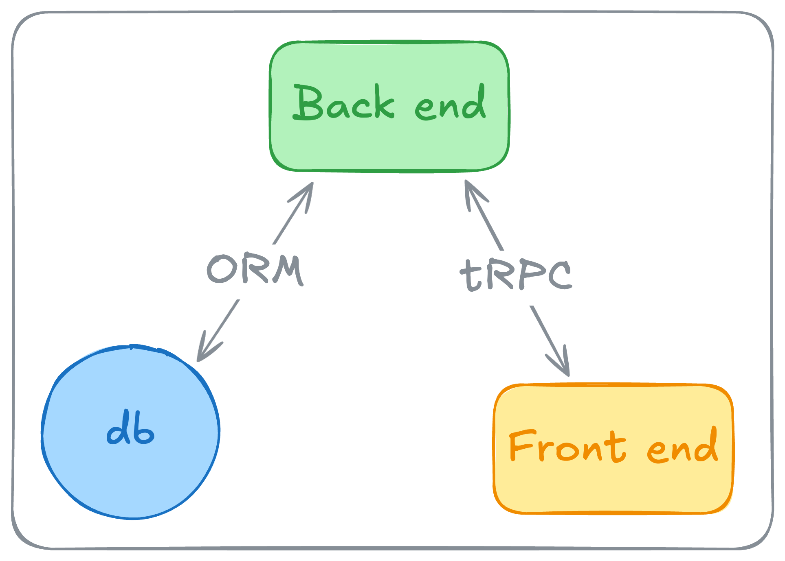

import video from './../v10-dark-landscape.mp4';

## TL;DR

Segurança de tipos de ponta a ponta (end-to-end type safety) conecta seu banco de dados, backend e frontend em um sistema de tipos unificado. Usando ferramentas como [Prisma](https://www.prisma.io/) ou [Drizzle](https://orm.drizzle.team/) para operações de banco de dados e [tRPC](https://trpc.io/) para comunicação de API, você pode:

- Eliminar erros de tipo em tempo de execução
- Inferir automaticamente tipos a partir do esquema do banco de dados e retornos de API
- Ter type safety de ponta a ponta em toda a sua stack
- Reduzir programação defensiva no seu código
- Refatorar com segurança e confiança

O resultado? Código mais limpo, mais fácil de manter, com menos bugs e melhor experiência de desenvolvimento para o seu time.

___

## Introdução

O desenvolvimento full-stack frequentemente envolve uma luta entre Frontend e Backend. Muitas vezes eles estão em repositórios diferentes, ou até mesmo em linguagens diferentes, sendo de responsabilidade de equipes diferentes. Isso faz com que a integração entre eles envolva alguns desafios.

Considere este exemplo:

```javascript
import React, { useState, useEffect } from 'react';

function PostsComponent() {
  const [posts, setPosts] = useState([]);
  const [error, setError] = useState(null);

  useEffect(() => {
    async function fetchData() {
      try {
        const response = await fetch('https://api.example.com/posts');
        const data = await response.json();
        // Não podemos ter certeza da estrutura dos dados
        setPosts(data);
      } catch (error) {
        setError(error);
      }
    }

    fetchData();
  }, []);

  return (
    <div>
      <h1>Posts</h1>
      {/* Não podemos ter certeza da estrutura dos posts */}
      {posts && posts.length > 0 ? (
        posts.map((post, index) =>
          post && post.title && post.content ? (
            <div key={index}>
              <h2>{post.title}</h2>
              <p>{post.content}</p>
            </div>
          ) : (
            <div key={index}><p>Formato de post inesperado</p></div>
          )
        )
      ) : (
        <p>Nenhum post disponível</p>
      )}
    </div>
  );
}
```

Nesta abordagem temos que fazer várias validações para evitar o erro clássico:

```
TypeError: Cannot read properties of undefined (reading 'title')
```

Existem algumas abordagens para resolver isso, como vamos ver ao longo do artigo.

### Definições de Tipos Manuais

Definir tipos manualmente para respostas de API parece ser uma boa solução:

```typescript
interface Post {
  id: number;
  title: string;
  content: string;
  createdAt: string;
}

interface PostsResponse {
  posts: Post[];
  totalCount: number;
}

function PostsComponent() {
  const [postsData, setPostsData] = useState<PostsResponse | null>(null);
  const [error, setError] = useState<Error | null>(null);

  useEffect(() => {
    async function fetchData() {
      try {
        const response = await fetch('https://api.example.com/posts');
        const data = await response.json() as PostsResponse; // Assertion de tipo, não validação!
        setPostsData(data);
      } catch (error) {
        setError(error as Error);
      }
    }

    fetchData();
  }, []);

  if (!postsData) {
    return <p>Carregando posts...</p>;
  }

  return (
    <div>
      <h1>Posts ({postsData.totalCount || 0})</h1>
      {postsData.posts.map(post => (
        <div key={post.id}>
          <h2>{post.title}</h2>
          <p>{post.content}</p>
        </div>
      ))}
    </div>
  );
}
```

Esta abordagem tem limitações significativas:
- **Falhas silenciosas quando APIs mudam**: Se o backend mudar (como renomear `totalCount` para `count`), o TypeScript não pegará porque é apenas uma assertion de tipo (estamos mentindo para o TypeScript, e para nós mesmos)
- **Sem validação em tempo de execução**: Os tipos do TypeScript desaparecem em tempo de execução
- **Duplicação de conhecimento**: Os tipos devem ser mantidos manualmente em sincronia com o backend (e se o backend mudar, temos que atualizar os tipos manualmente)
- **Mudanças no esquema da API se tornam breaking changes**: Alterações no backend podem quebrar silenciosamente o frontend

### Inferência de Tipos

Como vimos acima, a definição manual de tipos para respostas de API tem limitações. Como contrapartida temos a inferência de tipos, que deriva tipos diretamente da fonte:

```typescript
// Tipos inferidos do esquema do banco de dados via Prisma
const user = await prisma.user.findUnique({ where: { id: 1 } });
// user é totalmente tipado com base no esquema do seu banco de dados

// Ou com Drizzle
const user = await db.query.users.findFirst({ where: eq(users.id, 1) });
// user também é totalmente tipado com base no esquema do seu banco de dados
```

Os benefícios incluem:
- Uma única fonte de verdade
- Atualizações automáticas quando os esquemas mudam
- Tipos que refletem as estruturas de dados reais
- O compilador guiando você através das atualizações necessárias durante a refatoração

---

## End to End Type Safety

Segurança de tipos de ponta a ponta conecta seu banco de dados, backend e frontend em um sistema de tipos unificado onde os tipos fluem automaticamente através de cada camada, como mostra o diagrama abaixo.



Vamos ver como isso funciona na prática.

### tRPC

[tRPC](https://trpc.io/) (TypeScript Remote Procedure Call) é um framework que permite construir APIs totalmente seguras em termos de tipos com TypeScript. Ele funciona:

- Criando uma única fonte de verdade para os tipos da sua API
- Inferindo automaticamente tipos do retorno de suas funções backend
- Fornecendo chamadas de API do lado do cliente seguras em termos de tipos (construído em cima do [Tanstack Query](https://tanstack.com/query/latest))
- Eliminando a necessidade de geração de código ou definições de tipo manuais

A principal vantagem do tRPC é que ele permite que você chame seus procedimentos backend diretamente do seu código frontend, com segurança de tipos total e autocomplete. Isso significa que você obtém a mesma experiência de chamar uma função local, mas com os benefícios de uma chamada de API remota.

Nas palavras deles, o tRPC permite que você:

> Move Fast and Break Nothing. (faça mudanças rapidamente e não quebre nada).

Vamos ver isso em ação. No vídeo abaixo, você pode ver como o tRPC mantém a segurança de tipos em toda a sua stack:

<video
  src={video}
  autoPlay
  loop
  muted
  playsInline
  className="rounded-lg shadow-lg"
/>

<small className="text-gray-500 block text-center mb-4">Crédito do vídeo: [tRPC website](https://trpc.io/)</small>

No vídeo, o lado esquerdo mostra o código do servidor e o direito o código do cliente. O tRPC proporciona feedback instantâneo entre ambos - quando você modifica o código do servidor, o cliente é imediatamente atualizado. Erros de tipo aparecem automaticamente no cliente quando há incompatibilidades, indicando precisamente o que precisa ser corrigido.

A inferência automática de tipos do tRPC garante que sua IDE sempre mostre as propriedades disponíveis com seus tipos corretos em tempo real, mantendo todo o sistema sincronizado sem esforço adicional.

### Construindo com tRPC e ORMs

Aqui está como implementar segurança de tipos de ponta a ponta:

1. **Esquema do Banco de Dados** com [Prisma](https://www.prisma.io/) ou [Drizzle](https://orm.drizzle.team/):
```prisma
// schema.prisma (Prisma)
model Post {
  id        Int      @id @default(autoincrement())
  title     String
  content   String
  createdAt DateTime @default(now())
}
```

```typescript
// schema.ts (Drizzle)
import { pgTable, serial, text, timestamp } from 'drizzle-orm/pg-core';

export const posts = pgTable('posts', {
  id: serial('id').primaryKey(),
  title: text('title').notNull(),
  content: text('content').notNull(),
  createdAt: timestamp('created_at').defaultNow().notNull(),
});
```

2. **API Backend** com [tRPC](https://trpc.io/):
```typescript
// server/router.ts
export const appRouter = router({
  posts: router({
    getAll: publicProcedure.query(async () => {
      // Com Prisma
      return await prisma.post.findMany();
      
      // Ou com Drizzle
      return await db.query.posts.findMany();
    })
  })
});

// Exporta a definição de tipo da API
export type AppRouter = typeof appRouter;
```

3. **Integração Frontend**:
```typescript
// client/components/PostList.tsx
function PostsComponent() {
  // posts é automaticamente tipado como Post[] do seu esquema de banco de dados!
  const { data: posts, error, isLoading } = trpc.posts.getAll.useQuery();

  if (isLoading) return <p>Carregando posts...</p>;
  if (error) return <div>Erro: {error.message}</div>;
  if (!posts?.length) return <p>Nenhum post disponível</p>;

  return (
    <div>
      <h1>Posts</h1>
      {posts.map((post) => (
        <div key={post.id}>
          <h2>{post.title}</h2>
          <p>{post.content}</p>
          <em>Criado em: {post.createdAt.toLocaleDateString()}</em>
        </div>
      ))}
    </div>
  );
}
```

Os tipos fluem automaticamente através de cada camada:
1. O schema do banco de dados define a estrutura
2. O Prisma/Drizzle gera tipos TypeScript a partir do schema
3. O tRPC infere tipos de retorno do Prisma/Drizzle
4. Componentes React recebem dados totalmente tipados

Quando você faz alterações, como adicionar um campo `published` ao seu modelo `Post`:
1. O Prisma/Drizzle atualiza os tipos TypeScript após a regeneração
2. O tRPC infere automaticamente os novos tipos de retorno
3. O novo campo `published` é imediatamente disponível no frontend

### Validações com Zod

O TypeScript fornece segurança em tempo de compilação, mas a validação em tempo de execução ainda é necessária. O Zod preenche essa lacuna:

```typescript
import { z } from 'zod';

// Define um esquema que valida em tempo de execução
const PostSchema = z.object({
  title: z.string().min(1).max(100),
  content: z.string().min(10)
});

// Integração com tRPC
export const appRouter = router({
  posts: router({
    create: publicProcedure
      .input(PostSchema)
      .mutation(async ({ input }) => {
        // A entrada é validada antes deste código ser executado
        return await prisma.post.create({ data: input });
      })
  })
});
```

Esta combinação fornece:
- Validação em tempo de execução para garantir que os dados enviados para o backend tenham o formato esperado
- APIs auto-documentadas com requisitos de input explícitos
- Mensagens de erro automáticas com falhas de validação detalhadas
- Uma única fonte de verdade para tipos e regras de validação

Por exemplo, uma requisição do cliente com dados inválidos:

```typescript
trpc.posts.create.mutate({
  title: "", // Muito curto!
  content: "Este é um teste"
}).catch(error => {
  // ZodError com informações detalhadas sobre a falha de validação
});
```

---

## Abordagens Alternativas

Enquanto [tRPC](https://trpc.io/) com [Prisma](https://www.prisma.io/) ou [Drizzle](https://orm.drizzle.team/) oferecem soluções simples e efetivas, existem outras alternativas de obter resultados parecidos:

### Server Components e Actions

O React e Next.js introduziram [Server Components](https://nextjs.org/docs/app/building-your-application/rendering/server-components) e [Server Actions](https://nextjs.org/docs/app/building-your-application/data-fetching/server-actions-and-mutations), permitindo executar código no servidor dentro de componentes React.

Com Server Components, você pode acessar diretamente o banco de dados e obter tipos automáticos do Prisma, eliminando a necessidade de código de fetch no front end. Vamos ver um exemplo prático:

```typescript
// app/components/PostsList.tsx
import { prisma } from '@/lib/prisma';

export default async function PostsList() {
  const posts = await prisma.post.findMany({
    orderBy: { createdAt: 'desc' },
    take: 10
  });

  return (
    <div>
      <h1>Posts Recentes</h1>
      {posts.map((post) => (
        <article key={post.id}>
          <h2>{post.title}</h2>
          <p>{post.content}</p>
          <time dateTime={post.createdAt.toISOString()}>
            {post.createdAt.toLocaleDateString('pt-BR')}
          </time>
        </article>
      ))}
    </div>
  );
}
```

Para mutações, Server Actions podem ser combinados perfeitamente com Zod para validação em tempo de execução:

```typescript
// app/actions/posts.ts
'use server';

import { prisma } from '@/lib/prisma';
import { z } from 'zod';

const createPostSchema = z.object({
  title: z.string().min(1).max(100),
  content: z.string().min(10)
});

export async function createPost(data: z.infer<typeof createPostSchema>) {
  const validatedData = createPostSchema.parse(data);
  return await prisma.post.create({ data: validatedData });
}
```

No entanto, esta abordagem vem com alguns trade-offs importantes. Server Components não podem usar hooks como `useState` ou `useEffect`, o que significa que o estado deve ser gerenciado através de Server Actions ou client components. Isso pode tornar a arquitetura mais complexa para aplicações com muita interatividade.

A performance também requer atenção especial. Server Components podem bloquear a renderização se a operação for lenta, exigindo estratégias como streaming, Suspense boundaries e cache de dados.

Além disso, a separação entre Server and Client Components pode ser confusa inicialmente, e a tecnologia ainda é relativamente nova, com documentação e melhores práticas em evolução.

---

### GraphQL com CodeGen
Tipagem forte através da definição de esquema, mas requer:
- Aprender uma linguagem de consulta separada
- Ferramentas extras para cache e gerenciamento de estado
- Manutenção de esquema e resolvers

### OpenAPI/Swagger
APIs REST com tipos gerados, mas requer:
- Manutenção manual de especificações
- Desconexão entre implementação e especificação
- Complexidade adicional de build

Comparado às soluções alternativas, tRPC oferece as seguintes vantagens:
- Zero manutenção de esquema
- Integração nativa com TypeScript
- Conexão direta entre backend e frontend
- Um estilo de API mais natural baseado em chamadas de função

---

## Conclusão

A segurança de tipos de ponta a ponta transforma completamente o processo de desenvolvimento full-stack, fornecendo:

- **Uma única fonte de verdade**: Os tipos fluem de uma definição
- **Programação defensiva reduzida**: Menos necessidade de verificações em tempo de execução
- **Refatoração sem medo**: O TypeScript guia você através das mudanças
- **Foco na lógica de negócios**: Menos tempo gasto no gerenciamento de tipos
- **Desenvolvimento de recursos mais rápido**: Menos bugs de integração

Depois de experimentar a Full Stack Type Safety, voltar para sistemas não tipados parece como trabalhar no escuro. Seu código se torna mais limpo, mais fácil de manter e significativamente mais confiável, com seu editor fornecendo autocomplete e documentação para guiar o desenvolvimento.

---

## Agradecimentos

Este artigo não seria possível sem o trabalho incrível e o conhecimento compartilhado por estes desenvolvedores incríveis:

[Theo](https://x.com/theo) - Por seu conteúdo excepcional sobre tRPC e segurança de tipos, que me ajudou a entender a importância e o poder da segurança de tipos de ponta a ponta no desenvolvimento web moderno.

[Alex](https://x.com/alexdotjs) - Por criar o tRPC e empurrar os limites do desenvolvimento web seguro em termos de tipos, tornando nossas vidas como desenvolvedores muito mais fáceis e agradáveis.

[Colin McDonnell](https://x.com/colinhacks) - Por criar o Zod, a poderosa biblioteca de validação de esquemas com foco em TypeScript que se tornou uma ferramenta essencial para o desenvolvimento seguro em termos de tipos.

[Tanner Linsley](https://x.com/tannerlinsley) - Por criar o TanStack Query (anteriormente React Query), que revolucionou o fetching de dados em aplicações React e fornece a base para a experiência do lado do cliente do tRPC.

[TkDodo](https://x.com/tkdodo) - Por suas valiosas contribuições para o ecossistema TanStack Query e seu conteúdo educacional excepcional que ajudou inúmeros desenvolvedores a dominar o fetching de dados e o gerenciamento de estado.

[Julius](https://x.com/jullerino) - Por suas contribuições significativas ao tRPC, incluindo o desenvolvimento do adaptador tRPC para Next.js e seu trabalho na melhoria da experiência do desenvolvedor no ecossistema tRPC.

[Matt Pocock](https://x.com/mattpocockuk) - Por seu trabalho educacional excepcional em TypeScript, que ajudou a comunidade a dominar tipos avançados e a importância da segurança de tipos em aplicações modernas.
