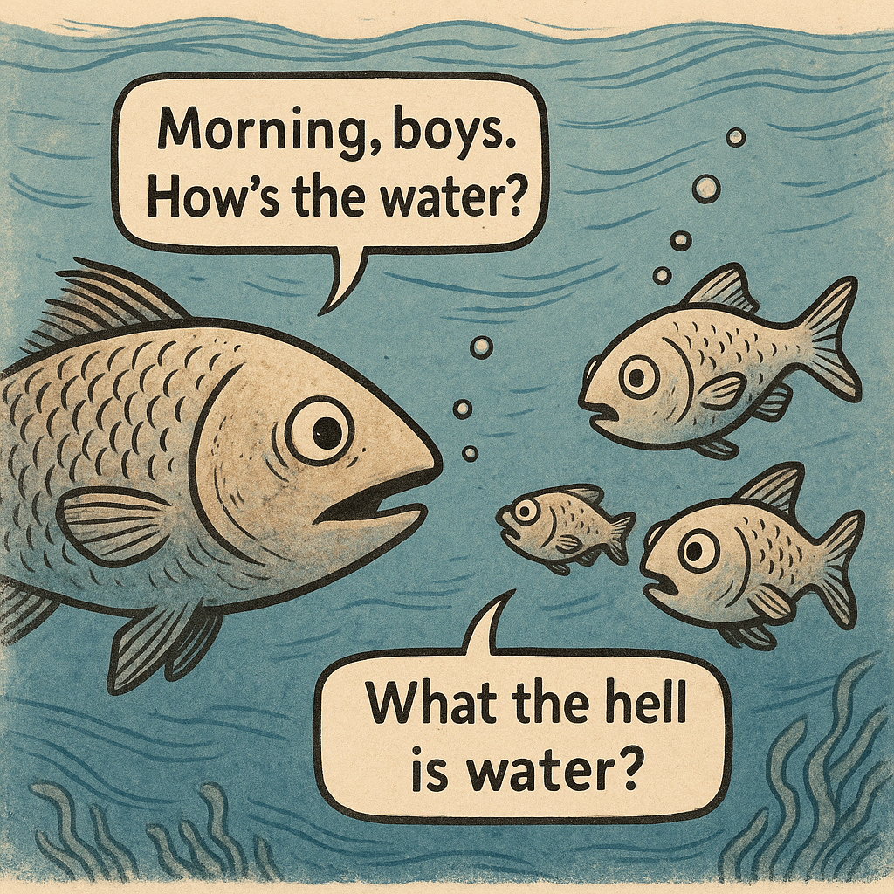
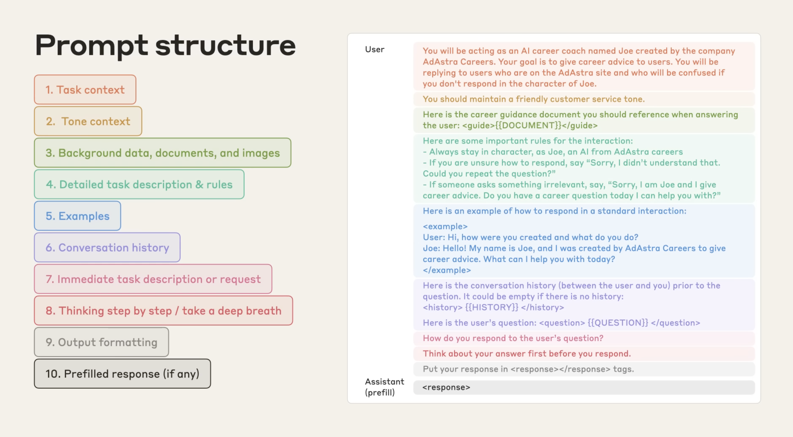

import Callout from "@/components/Callout.astro";
import HumanVsAIRadarChart from "@/components/HumanVsAIRadarChart.astro";
import TaskEquationVisualizer from "@/components/TaskEquationVisualizer.astro";

## TL;DR

Task success depends on three factors: knowledge, context, and tools. They multiply, not add, so if any one is missing, the probability of success collapses.
- Humans: Usually limited in knowledge, but rich in context (through shared understanding) and with practically unlimited access to tools.
- AIs: Vast in knowledge, but depend on tool access and explicit context to perform.

That's why in the AI era, context is the bottleneck. Clear, structured context is the leverage that turns AI from unreliable guesswork into a reliable collaborator.

---

## The equation

Imagine someone gives you a task. What determines whether you succeed? We can break it down into three main factors:

1. **<span class="term-knowledge">Knowledge (K)</span>**: what you already know. This includes domain expertise, learned skills, past experiences, and accumulated wisdom.  
2. **<span class="term-context">Context (C)</span>**: information about this specific task. The who, what, when, where, and why that turns a generic request into an actionable one.  
3. **<span class="term-tools">Tools (T)</span>**: what you can use to get it done. Instruments, software, processes, collaborators, or your ability to invent new solutions.

After thinking about how these factors interact with each other, I would say that the probability is the product of these factors:

<p class="text-xl font-semibold rounded-lg p-2">p = <span class="term-knowledge">K</span> × <span class="term-context">C</span> × <span class="term-tools">T</span></p>

Different types of tasks require different balances of these factors. It's unlikely that an <span class="term-knowledge">experienced</span> plumber could fix a leak without the <span class="term-tools">right tools</span>, while a lawyer would hardly solve a case without <span class="term-knowledge">legal knowledge</span> and diving into the <span class="term-context">case context</span>. This leads to the complete equation:

<p class="text-xl font-semibold rounded-lg p-2">p = <span class="term-knowledge">K</span><sup><span class="term-knowledge-weight">α</span></sup> × <span class="term-context">C</span><sup><span class="term-context-weight">β</span></sup> × <span class="term-tools">T</span><sup><span class="term-tools-weight">γ</span></sup></p>

The exponents are used to adjust the importance of each factor for each type of task, with <span class="term-knowledge-weight">α</span>, <span class="term-context-weight">β</span>, <span class="term-tools-weight">γ</span> ≥ 0 and <span class="term-knowledge-weight">α</span> + <span class="term-context-weight">β</span> + <span class="term-tools-weight">γ</span> = 1. Check the interactive visualizer below to see how the equation works.

<details class="animate group rounded-lg border border-black/15 dark:border-white/20 mb-6">
    <summary class="cursor-pointer rounded-t-lg px-3 py-1.5 font-medium transition-colors group-open:bg-black/5 hover:bg-black/5 dark:group-open:bg-white/5 hover:dark:bg-white/5">Understanding the exponents</summary>
    <div class="py-3 px-6">
    The exponents determine how much each factor influences the overall probability. When an exponent approaches 0, that component becomes less critical to success. When it's higher, that component has more impact on the final result.

    For example, if <span class="term-context-weight">β</span> = 0.8 and <span class="term-knowledge-weight">α</span> = 0.1, then <span class="term-context">context</span> dominates: even with perfect <span class="term-knowledge">knowledge</span> (K=1.0), poor <span class="term-context">context</span> (C=0.2) would give:

    <Callout>
        p = 1.0^0.1 × 0.2^0.8 × T^0.1 ≈ 0.28 × T^0.1
    </Callout>

    But with good <span class="term-context">context</span> (C=0.9), you get:

    <Callout>
        p = 1.0^0.1 × 0.9^0.8 × T^0.1 ≈ 0.92 × T^0.1
    </Callout>

    Each exponent matters differently depending on the situation:

    - **<span class="term-knowledge-weight">α</span> (<span class="term-knowledge">knowledge</span> exponent):** Higher for specialized domains (e.g. surgery α≈0.6), lower for routine tasks (data entry α≈0.2).  
    - **<span class="term-context-weight">β</span> (<span class="term-context">context</span> exponent):** Extremely high for debugging (β≈0.7), moderate for creative tasks (β≈0.4).  
    - **<span class="term-tools-weight">γ</span> (<span class="term-tools">tools</span> exponent):** Strong in technical work (γ≈0.5), lower in pure reasoning (γ≈0.2).
    </div>
</details>
<details class="animate group rounded-lg border border-black/15 dark:border-white/20 mb-6">
<summary class="cursor-pointer rounded-t-lg px-3 py-1.5 font-medium transition-colors group-open:bg-black/5 hover:bg-black/5 dark:group-open:bg-white/5 hover:dark:bg-white/5">Interactive visualizer</summary>
  <TaskEquationVisualizer />
</details>


Multiplication matters. You can't compensate for missing context with more knowledge or better tools. A surgeon with perfect training and vast experience still fails if they don't know which procedure to perform or have access to patient information. Similarly, AI with vast knowledge fails on vague prompts like "Deploy failed. Fix it!" without environment details, logs, or recent changes.

---

## Humans × AI

The same three factors (knowledge, context, and tools) apply to both humans and AIs, but they manifest in very different ways.

<HumanVsAIRadarChart />

Human experts still outperform AIs when you consider knowledge, context, and tools together. At the same time, AIs already surpass the average human on raw knowledge. As models improve, success will hinge less on adding knowledge and more on supplying precise context and access to the right tools.

| Factor | **Humans** | **AIs** |
|--------|------------|---------|
| **Knowledge** | Limited but deep. Built through practice, learning, and lived experience. Intuitive connections over time. | Vast and increasingly deep. Acquired in model pre-training on top of a vast database, practically everything available online. |
| **Context** | Inferred almost automatically: native language, tone of voice, shared history, assumptions, cultural priors. | Minimal unless explicitly provided. Models lack your personal history, environment, or shared assumptions. Every relevant detail must be stated. |
| **Tools** | Practically unlimited. We adapt, combine, or invent tools on demand. | Limited to what’s wired in (APIs, code exec, browsers, MCPs). Cannot create new tools, but can use existing ones to gather missing context when guided. |

**The result:** Humans usually struggle with *knowledge*, which is why education takes years. AIs struggle with *context*, which is why prompt (or context) engineering exists.

---

## AI Agents

If you've tried to build AI agents, this framing is nothing new: Agents are a product of knowledge, context, and tools.

| Equation | Agent concept | Examples |
|---|---|---|
| **Knowledge** | Model weights / pretrained knowledge | `gpt-5`, domain-tuned checkpoints |
| **Context** | System prompt, messages, retrieval (RAG), memory, files, parameters | Goal/constraints, env & versions, docs, customer record |
| **Tools** | Function calling / APIs, DB access, browsers, code exec, MCPs | `search()`, `getOrders()`, Vercel deploys, Slack post |

Here is a simple example of an AI agent in Next.js using the [Vercel AI SDK](https://sdk.vercel.ai/docs):

```ts
// app/api/agent/route.ts — Next.js (Vercel AI SDK)
import { openai } from '@ai-sdk/openai';
import { streamText } from 'ai';
import { z } from 'zod';

export async function POST(req: Request) {
  const { messages } = await req.json();

  const result = await streamText({
    model: openai('gpt-4o-mini'), // knowledge
    system: 'You are a helpful agent. Use tools when needed.', // context
    messages, // context
    tools: { // tools
      getWeather: { // tool name
        description: 'Get current weather for a city', // tool description
        parameters: z.object({ // tool parameters
          city: z.string().min(1, 'city is required'),
          unit: z.enum(['metric', 'imperial']).default('metric'),
        }),
        // tool execution
        execute: async ({ city, unit }) => {
          const res = await fetch(`https://example.com/api/weather?city=${encodeURIComponent(city)}&unit=${unit}`);
          if (!res.ok) throw new Error('weather fetch failed');
          const data = await res.json();
          return `${data.temp}°${unit === 'metric' ? 'C' : 'F'} and ${data.description} in ${city}`;
        },
      },
    },
  });

  return result.toAIStreamResponse();
}
```

---

## Applying the equation

Let's see the equation in action with a debugging scenario:

**Before (poor context):**  
<Callout type="error">
Vercel deploy failed. Help!
</Callout>

Almost no information: which deploy? what error? what environment?

**After (good context, structured):**  
<Callout type="success">
> **Goal:** Get production build passing again.  
> **Symptom:** Deploys fail since commit `b7c9d1e`, error: `Module not found: '@/components/Button'`.  
> **Env:** Next.js 14, Node 20, Vercel build image `2025.07`.  
> **Tried:** Cleared `.next` and `.vercel`, redeployed twice, confirmed local build works.  
> **Links:** Failing build log [link], commit `b7c9d1e`.  
> **Ask:** Identify cause (path alias vs case-sensitive import?) and suggest fix or rollback.  
</Callout>  

**Good context more than doubles the odds of success—from 36% to 88%.** The same expert, same tools; clear context transforms a likely struggle into a near-win.

<details class="animate group rounded-lg border border-black/15 dark:border-white/20 mb-6">
    <summary class="cursor-pointer rounded-t-lg px-3 py-1.5 font-medium transition-colors group-open:bg-black/5 hover:bg-black/5 dark:group-open:bg-white/5 hover:dark:bg-white/5">Mathematical breakdown</summary>

    <div class="py-3 px-6">
    Debugging tasks have high context dependency, so I used these exponents:

    - **α** = 0.2 (knowledge exponent): Moderate contribution from domain knowledge
    - **β** = 0.6 (context exponent): Very high, debugging is nearly impossible without specifics
    - **γ** = 0.2 (tools exponent): Moderate, debugging benefits from logs, version control, etc.

    With minimal context (**C** ≈ 0.2), decent knowledge (**K** ≈ 0.8), and good tools (**T** ≈ 0.9):
       
       
    <Callout>
    <p class="text-l font-semibold rounded-lg p-2">p = 0.8<sup>0.2</sup> × 0.2<sup>0.6</sup> × 0.9<sup>0.2</sup> ≈ 0.36 or 36%</p>
    </Callout>

    With rich context (**C** ≈ 0.9), same knowledge (**K** ≈ 0.8), and same tools (**T** ≈ 0.9):
    
    <Callout>
    <p class="text-l font-semibold rounded-lg p-2">p = 0.8<sup>0.2</sup> × 0.9<sup>0.6</sup> × 0.9<sup>0.2</sup> ≈ 0.88 or 88%</p>
    </Callout>
    </div>
</details>

---

## Why do we neglect context

We neglect context because we carry it invisibly. Our assumptions, mental models, and shared history feel so obvious that we forget others (or AIs) don't share them.

David Foster Wallace captured this beautifully in his [2005 commencement speech at Kenyon College](https://www.youtube.com/watch?v=8CrOL-ydFMI):


<p class="text-center text-sm italic">Illustration generated by GPT-5</p>

Context is our water. It's so fundamental to how we navigate the world that we don't even notice it. We assume others share our mental environment: our cultural references, our technical background, our immediate situation. But like those fish, we're often unaware of the medium we're swimming in.

On top of that, context feels like overhead. Typing "Deploy failed. Fix it!" feels efficient, even though it guarantees multiple back-and-forths later.

These shortcuts work (somewhat) in human-to-human interaction, because we're good at inferring context from tone, body language, and shared experience. But with AI, the problem gets amplified, we're communicating with something that doesn't share our water.

Another reason is our fundamental misunderstanding of how models work:

<blockquote class="twitter-tweet" data-theme="light"><p lang="en" dir="ltr">What I find endlessly fascinating:<br /><br />Some engineers really can&#39;t seem to grasp that LLMs are non-deterministic and how to build software taking that into account.<br /><br />For others it immediately clicked, but for some it seems like there&#39;s a real mental barrier to accept it.</p>&mdash; Thorsten Ball (@thorstenball) <a href="https://twitter.com/thorstenball/status/1956017792484040731?ref_src=twsrc%5Etfw">August 14, 2025</a></blockquote> <script async src="https://platform.twitter.com/widgets.js" charset="utf-8"></script>

LLMs have quirks that make context essential:
- **Nondeterminism:** The same prompt can yield different outputs. Good context narrows the range of possible answers, reducing randomness.
- **Knowledge cutoffs:** Models don't know anything past their training date. Explicit context about versions, updates, or recent changes patches that gap.
- **Hallucinations:** When missing details, models make things up with confidence. Rich context grounds them, leaving less room to fabricate.

All three quirks share the same fix: clear, structured context turns uncertain guesses into reliable solutions.

---

## The rise of context engineering

AI has fundamentally shifted what skills matter. In the pre-AI era, success required accumulating knowledge and acquiring better tools. Now, with models that already possess vast knowledge and expanding tool access, **context engineering** has emerged as the critical skill.

Tobi Lütke captured this shift perfectly:

<blockquote class="twitter-tweet" data-theme="light"><p lang="en" dir="ltr">I really like the term "context engineering" over prompt engineering. <br /><br />It describes the core skill better: the art of providing all the context for the task to be plausibly solvable by the LLM.</p>&mdash; tobi lutke (@tobi) <a href="https://twitter.com/tobi/status/1935533422589399127?ref_src=twsrc%5Etfw">June 19, 2025</a></blockquote> <script async src="https://platform.twitter.com/widgets.js" charset="utf-8"></script>

Context engineering is becoming as fundamental as programming was in the software era. Just as developers learned to structure code, debug systems, and design architectures, we now need to learn how to:

- **Structure information** for AI consumption
- **Anticipate missing context** that humans take for granted  
- **Design context frameworks** that scale across different tasks and domains
- **Debug context gaps** when AI outputs fall short

The professionals who master context engineering will have the same advantage early programmers had: they'll be able to reliably harness the most powerful tools of their era while others struggle with inconsistent results.

---

## Practical guide

Context engineering is about providing all the context needed to make a task plausibly solvable by the LLM. A well-structured prompt includes:


<p class="text-center text-sm italic">Diagram from <a href="https://www.youtube.com/watch?v=ysPbXH0LpIE">Advanced Prompt Engineering</a> by Anthropic</p>

1. **Task context** - The specific situation and background
2. **Tone context** - How the AI should communicate
3. **Background data, documents, and images** - Relevant information
4. **Detailed task description & rules** - Clear, specific instructions
5. **Examples** - Concrete demonstrations of expected output
6. **Conversation history** - Previous relevant interactions
7. **Immediate task description or request** - The current specific request
8. **Thinking step by step / take a deep breath** - Breaking down complex problems
9. **Output formatting** - How results should be structured
10. **Prefilled response (if any)** - Starting the AI's response pattern

Notice how some of these components make no sense for us humans, they sound completely obvious or even redundant. You wouldn't tell a colleague "you are a career coach named Joe" or "you should respond in a friendly customer service tone" because humans infer context naturally.

This kind of context is precisely where AI shines: when given these explicit details that humans take for granted, AI can process vast amounts of structured context and maintain perfect attention to every specified requirement.

---

## Conclusion

The **task-solving equation** highlights the shift of the AI era. Success no longer hinges on accumulating more knowledge or better tools. Those are increasingly commoditized. What's scarce is the ability to provide rich, explicit context.

Humans succeed despite limited knowledge because we're rich in context and adaptable with tools. AIs succeed only when we deliberately supply the missing context. Every assumption, every nuance, every artifact matters.

As Guillermo Rauch observed:

<blockquote class="twitter-tweet" data-theme="light"><p lang="en" dir="ltr">Imagine success being determined purely based on the quality of your thoughts. That's the promise of AI</p>&mdash; Guillermo Rauch (@rauchg) <a href="https://twitter.com/rauchg/status/1956356467898114443?ref_src=twsrc%5Etfw">August 15, 2025</a></blockquote> <script async src="https://platform.twitter.com/widgets.js" charset="utf-8"></script>


The quality of your thoughts (expressed through clear context) now determines success.  

Next time you give a task to an AI (or a teammate), ask yourself: Did I give enough <span class="term-knowledge">knowledge</span>, <span class="term-context">context</span>, and <span class="term-tools">tools</span>?
