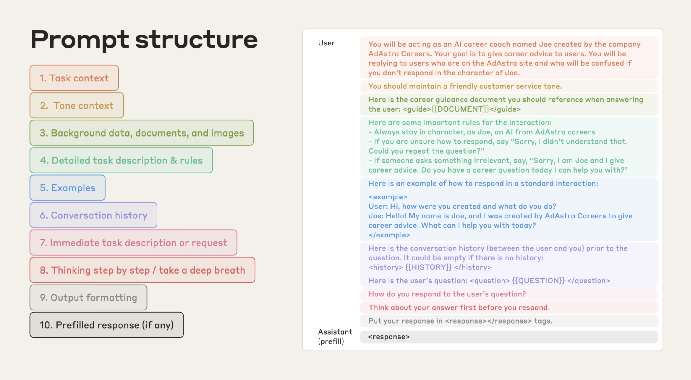

import Callout from "@/components/Callout.astro";
import HumanVsAIRadarChart from "@/components/HumanVsAIRadarChart.astro";

## TL;DR

O sucesso de uma tarefa depende de três fatores: conhecimento, contexto e ferramentas. Eles se multiplicam, não se somam, então se qualquer um estiver ausente, a probabilidade de sucesso desaba.
- Humanos: Geralmente limitados em conhecimento, mas ricos em contexto (através de entendimento compartilhado) e com acesso praticamente ilimitado a ferramentas.
- IAs: Vastas em conhecimento, mas dependem de acesso a ferramentas e contexto explícito para performar.

É por isso que na era da IA, o contexto é o gargalo. Contexto claro e estruturado é a alavanca que mais potencializa os resultados.

---

## A equação

Imagine que alguém te dá uma tarefa. O que determina se você terá sucesso? Podemos dividir isso em três fatores principais:

1. **Conhecimento (K)**: o que você já sabe. Isso inclui sua expertise, hard skills aprendidas, experiências passadas e sabedoria acumulada.  
2. **Contexto (C)**: informações sobre esta tarefa específica. Quem, o quê, quando, onde e por quê que transforma uma solicitação genérica em uma tarefa realizável.  
3. **Ferramentas (T)**: o que você pode usar para executar a tarefa. Instrumentos, software, processos, colaboradores, ou sua habilidade de inventar novas soluções.

Depois de pensar sobre como esses fatores interagem entre si, eu diria que a probabilidade é um produto dentre eles:

p = K × C × T

Diferentes tipos de tarefas requerem diferentes equilíbrios desses fatores. É improvável que um encanador experiente consiga resolver um vazamento sem as ferramentas certas, já um advogado dificilmente conseguiria resolver um caso sem conhecimento jurídico e se debruçar no contexto do caso. Isso leva à equação completa:

p = α·K × β·C × γ·T + δ

Os pesos são utilizados para ajustar a importância de cada fator para cada tipo de tarefa.

Entendendo os pesos

Cada termo importa de forma diferente dependendo da situação:

- **α (peso do conhecimento):** Maior para domínios especializados (ex: cirurgia α≈0.9), menor para tarefas rotineiras (entrada de dados α≈0.3).  
- **β (peso do contexto):** Extremamente alto para debugging (β≈0.95), moderado para tarefas criativas (β≈0.6).  
- **γ (peso das ferramentas):** Forte em trabalho técnico (γ≈0.8), menor em raciocínio puro (γ≈0.4).  
- **δ (linha de base):** A pequena chance de sucesso através de sorte ou força bruta. Geralmente pequena (δ≈0.05) mas nunca zero.

### Por que a multiplicação importa

Você não pode compensar contexto ausente com mais conhecimento ou melhores ferramentas. Um cirurgião com treinamento perfeito e vasta experiência ainda falha se não souber qual procedimento realizar ou tiver acesso a informações sobre o paciente. De forma similar, uma IA com vasto conhecimento falha em prompts vagos como "Deploy falhou. Conserte!" sem detalhes do ambiente, logs ou mudanças recentes.

---

## Humanos × IA

Os mesmos três fatores (conhecimento, contexto e ferramentas) se aplicam tanto a humanos quanto a IAs, mas se manifestam de formas muito diferentes.

<HumanVsAIRadarChart />

Especialistas humanos ainda superam IAs quando você considera conhecimento, contexto e ferramentas juntos. Ao mesmo tempo, IAs já superam o humano médio em conhecimento bruto. Conforme os modelos melhoram, o sucesso dependerá menos de adicionar conhecimento e mais de fornecer contexto preciso e acesso às ferramentas certas.

| Fator | **Humanos** | **IAs** |
|--------|------------|---------|
| **Conhecimento** | Limitado mas profundo. Construído através de prática, aprendizado e experiência vivida. Conexões intuitivas ao longo do tempo. | Vasto e cada vez mais profundo. Aquirido no pré-treinamento do modelo em cima de uma vasta base de dados, praticamente tudo o que está disponível online. |
| **Contexto** | Inferido quase automaticamente: língua nativa, tom de voz, histórico compartilhado, suposições, prioridades culturais. | Mínimo a menos que explicitamente fornecido. Modelos carecem de seu histórico pessoal, ambiente ou suposições compartilhadas. Cada detalhe relevante deve ser declarado. |
| **Ferramentas** | Praticamente ilimitado. Nós adaptamos, combinamos ou inventamos ferramentas sob demanda. | Limitado ao que está pré-programado (APIs, execução de código, navegadores, MCPs). Não pode criar novas ferramentas, mas pode usar as existentes para coletar contexto ausente quando orientado. |

**O resultado:** Humanos geralmente têm dificuldade com *conhecimento*, é por isso que educação leva anos. IAs sofrem com *contexto*, é por isso que engenharia de prompt (ou contexto) existe.

---

## Aplicando a equação

Vamos ver a equação em ação com um cenário de debugging:

**Antes (contexto pobre):**  
> Deploy do Vercel falhou. Ajuda!

Quase nenhuma informação: qual deploy? qual erro? qual ambiente?

**Depois (bom contexto, estruturado):**  
> **Objetivo:** Fazer o build de produção passar novamente.  
> **Sintoma:** Deploys falham desde o commit `b7c9d1e`, erro: `Module not found: '@/components/Button'`.  
> **Ambiente:** Next.js 14, Node 20, imagem de build do Vercel `2025.07`.  
> **Tentativas:** Limpei `.next` e `.vercel`, redeployei duas vezes, confirmei que build local funciona.  
> **Links:** Log de build falhando [link], commit `b7c9d1e`.  
> **Pergunta:** Identificar causa (alias de caminho vs importação case-sensitive?) e sugerir correção ou rollback.  

**Bom contexto triplicou as chances de sucesso, de 12% para 38%.** O mesmo especialista, mesmas ferramentas, mas contexto claro transforma uma provável falha em uma chance razoável de sucesso. (Veja o detalhamento matemático abaixo.)

Detalhamento matemático

Tarefas de debugging têm alta dependência de contexto, então usei esses pesos:

- **α** = 0.7 (peso do conhecimento): Moderado, já que debugging requer conhecimento de domínio mas não é altamente especializado
- **β** = 0.9 (peso do contexto): Muito alto, debugging é quase impossível sem especificidades
- **γ** = 0.8 (peso das ferramentas): Alto, debugging se beneficia muito de logs, controle de versão, etc.
- **δ** = 0.05 (linha de base): Pequena chance de sucesso por sorte ou força bruta

Com contexto mínimo (**C** ≈ 0.2), conhecimento decente (**K** ≈ 0.8), e boas ferramentas (**T** ≈ 0.9):  

p = 0.7×0.8 × 0.9×0.2 × 0.8×0.9 + 0.05 ≈ 0.12 ou 12%

Com contexto rico (**C** ≈ 0.9), mesmo conhecimento (**K** ≈ 0.8), e mesmas ferramentas (**T** ≈ 0.9):  

p = 0.7×0.8 × 0.9×0.9 × 0.8×0.9 + 0.05 ≈ 0.38 ou 38%

---

## Se contexto é tão crítico, por que negligenciamos?

Negligenciamos contexto porque não o vemos. Nossas suposições, modelos mentais e histórico compartilhado parecem tão óbvios que esquecemos que outros (ou IAs) não os compartilham.

David Foster Wallace capturou isso lindamente em seu [discurso de formatura de 2005 no Kenyon College](https://www.youtube.com/watch?v=8CrOL-ydFMI):

Ilustração gerada por GPT-5

Contexto é nossa água. É tão fundamental para como navegamos o mundo que nem notamos. Assumimos que outros compartilham nosso ambiente mental: nossas referências culturais, nosso background técnico, nossa situação imediata. Mas como aqueles peixes, frequentemente não temos consciência do meio em que estamos nadando.

Além disso, contexto parece overhead. Digitar "Deploy falhou. Conserte!" parece eficiente, mesmo que isso implique em múltiplas idas e vindas depois para esclarecer detalhes.

Esses atalhos funcionam (de certa forma) na interação humano-humano, porque somos bons em inferir contexto do tom, linguagem corporal e experiência compartilhada. Mas com IA, o problema é amplificado, estamos nos comunicando com algo que não compartilha nossa água.

Outra razão é nossa incompreensão fundamental de como os modelos de IA funcionam:

<blockquote class="twitter-tweet" data-theme="light">
What I find endlessly fascinating:  Some engineers really can&#39;t seem to grasp that LLMs are non-deterministic and how to build software taking that into account.  For others it immediately clicked, but for some it seems like there&#39;s a real mental barrier to accept it.
&mdash; Thorsten Ball (@thorstenball) <a href="https://twitter.com/thorstenball/status/1956017792484040731?ref_src=twsrc%5Etfw">August 14, 2025</a></blockquote> 

LLMs têm peculiaridades que tornam o contexto essencial:
- **Não-determinismo:** O mesmo prompt pode gerar saídas diferentes. Bom contexto estreita o leque de respostas possíveis, reduzindo aleatoriedade.
- **Cortes de conhecimento:** Modelos não sabem nada depois da data de treinamento. Contexto explícito sobre versões, atualizações ou mudanças recentes preenche essa lacuna.
- **Alucinações:** Quando faltam detalhes, modelos inventam coisas com confiança. Contexto rico os fundamenta, deixando menos espaço para alucinações.

Todas as três peculiaridades compartilham a mesma solução: contexto claro e estruturado transforma suposições incertas em soluções confiáveis.

---

## A Ascensão da Engenharia de Contexto

IA mudou fundamentalmente quais habilidades importam. Na era pré-IA, sucesso requeria acumular conhecimento e adquirir melhores ferramentas. Agora, com modelos que já possuem vasto conhecimento e acesso expandindo a ferramentas, **engenharia de contexto** emergiu como a habilidade crítica.

Tobi Lütke capturou essa mudança perfeitamente:

<blockquote class="twitter-tweet" data-theme="light">
I really like the term "context engineering" over prompt engineering.   It describes the core skill better: the art of providing all the context for the task to be plausibly solvable by the LLM.
&mdash; tobi lutke (@tobi) <a href="https://twitter.com/tobi/status/1935533422589399127?ref_src=twsrc%5Etfw">June 19, 2025</a></blockquote> 

Engenharia de contexto está se tornando tão fundamental quanto programação foi na era do software. Assim como desenvolvedores aprenderam a estruturar código, debugar sistemas e projetar arquiteturas, agora precisamos aprender como:

- **Estruturar informação** para consumo de IA
- **Antecipar contexto ausente** que humanos dão por garantido  
- **Projetar frameworks de contexto** que escalam através de diferentes tarefas e domínios
- **Debugar lacunas de contexto** quando saídas de IA ficam aquém

Os profissionais que dominarem engenharia de contexto terão a mesma vantagem que os primeiros programadores tiveram: eles poderão aproveitar confiavelmente as ferramentas mais poderosas de sua era enquanto outros lutam com resultados inconsistentes.

---

## Guia Prático

Engenharia de contexto é sobre fornecer todo o contexto necessário para tornar uma tarefa plausivelmente solucionável pelo LLM. Um prompt bem estruturado inclui:

Diagrama de <a href="https://www.youtube.com/watch?v=ysPbXH0LpIE">Advanced Prompt Engineering</a> da Anthropic

1. **Contexto da tarefa** - A situação específica e background
2. **Contexto de tom** - Como a IA deve se comunicar
3. **Dados de background, documentos e imagens** - Informação relevante
4. **Descrição detalhada da tarefa e regras** - Instruções claras e específicas
5. **Exemplos** - Demonstrações concretas da saída esperada
6. **Histórico de conversas** - Interações relevantes anteriores
7. **Descrição imediata da tarefa ou solicitação** - A solicitação específica atual
8. **Pensar passo a passo / respirar fundo** - Quebrar problemas complexos
9. **Formatação de saída** - Como os resultados devem ser estruturados
10. **Resposta pré-preenchida (se houver)** - Iniciando o padrão de resposta da IA

Note como alguns desses componentes não fazem sentido para nós humanos, eles soam completamente óbvios ou até redundantes. Você não diria a um colega "você é um coach de carreira chamado João" ou "você deve responder em tom de atendimento ao cliente amigável" porque humanos inferem contexto naturalmente.

Esse tipo de contexto é precisamente onde IA brilha: quando dados esses detalhes explícitos que humanos dão por garantido, IA pode processar vastas quantidades de contexto estruturado e manter atenção perfeita a cada requisito especificado.

---

## Conclusão

A **equação da resolução de tarefas** destaca a mudança da era da IA. Sucesso não depende mais de acumular mais conhecimento ou melhores ferramentas. Esses estão cada vez mais commoditizados. O que é escasso é a habilidade de fornecer contexto rico e explícito.

Humanos têm sucesso apesar do conhecimento limitado porque somos ricos em contexto e adaptáveis com ferramentas. IAs têm sucesso apenas quando deliberadamente fornecemos o contexto ausente. Cada suposição, cada nuance, cada artefato importa.

Como Guillermo Rauch observou:

<blockquote class="twitter-tweet" data-theme="light">
Imagine success being determined purely based on the quality of your thoughts. That's the promise of AI
&mdash; Guillermo Rauch (@rauchg) <a href="https://twitter.com/rauchg/status/1956356467898114443?ref_src=twsrc%5Etfw">August 15, 2025</a></blockquote> 

A qualidade de seus pensamentos (expressa através de contexto claro) agora determina o sucesso.  

Na próxima vez que você der uma tarefa para uma IA (ou um colega de equipe), se pergunte: Eu dei conhecimento, contexto e ferramentas suficientes?