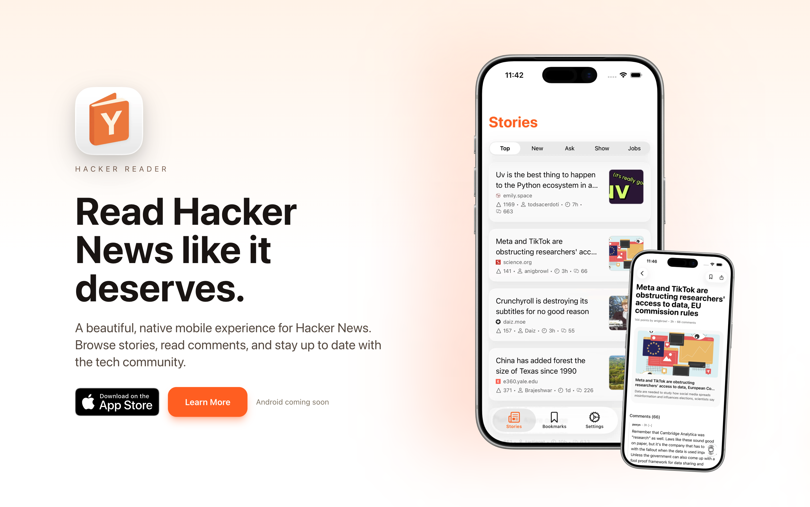

## De volta ao mundo mobile

Desde que saí da TC em 2023 onde trabalhei como Mobile Lead pra focar na Quarto à Vista, fiquei longe do mundo mobile. Foram quase 3 anos sem contato com um mundo que muda muito, mas muito rápido.

Recentemente alguns projetos internos na Qavi demandaram desenvolvimento mobile. Decidimos utilizar React Native com Expo, e resolvi usar essa oportunidade pra me reinserir no mundo mobile com um projeto pessoal utilizando as melhores práticas atuais.

Usei essa oportunidade para fazer todo o processo do zero, do design ao desenvolvimento, passando por landing page, copy, publicação nas lojas, e tudo mais.

## O Projeto

**Hacker Reader** é um leitor nativo do Hacker News, o fórum da Y Combinator conhecido por reunir as principais discussões sobre tecnologia e empreendedorismo. Leitura obrigatória para quem vive o mundo de startups.

Busquei aproveitar ao máximo as features nativas do iOS para criar uma experiência verdadeiramente polida:

- **Liquid Glass** — efeitos visuais modernos e fluidos
- **Link Previews** — visualização rica de links com Open Graph
- **Context Menus** — menus contextuais nativos para interações rápidas
- **Native Tabs** — navegação por abas seguindo os padrões do iOS
- **Home Screen Widgets** — widgets em três tamanhos exibindo Top Stories com atualização automática

## Stack Técnica

O projeto é um monorepo completo que inclui:

- **Mobile App**: Expo SDK 54 + React Native 0.81 com React Compiler
- **Web**: Next.js 15 App Router para landing page e marketing
- **Funcionalidades**: Autenticação com o Hacker News, votação, favoritos, comentários, busca via API, e bookmarks persistentes
- **Widgets iOS**: Três tamanhos (pequeno/médio/grande) com deep linking e suporte offline

Tudo em TypeScript, React Query para gerenciamento de estado, Expo router para navegação e Expo UI para algumas interfaces nativas.

## Open Source

O app é completamente open source sob licença MIT. Você pode explorar todo o código, arquitetura e decisões técnicas no repositório.

Links:

- [App Store](https://apps.apple.com/us/app/hacker-reader/id6754137305)
- [Site](https://www.hackerreader.app/)
- [Github](https://github.com/danielcspaiva/hacker-reader)

---

**Se você baixar o app, me conta aqui o que achou, e deixe seu review na App Store!** 🙏

*Android em breve...*
